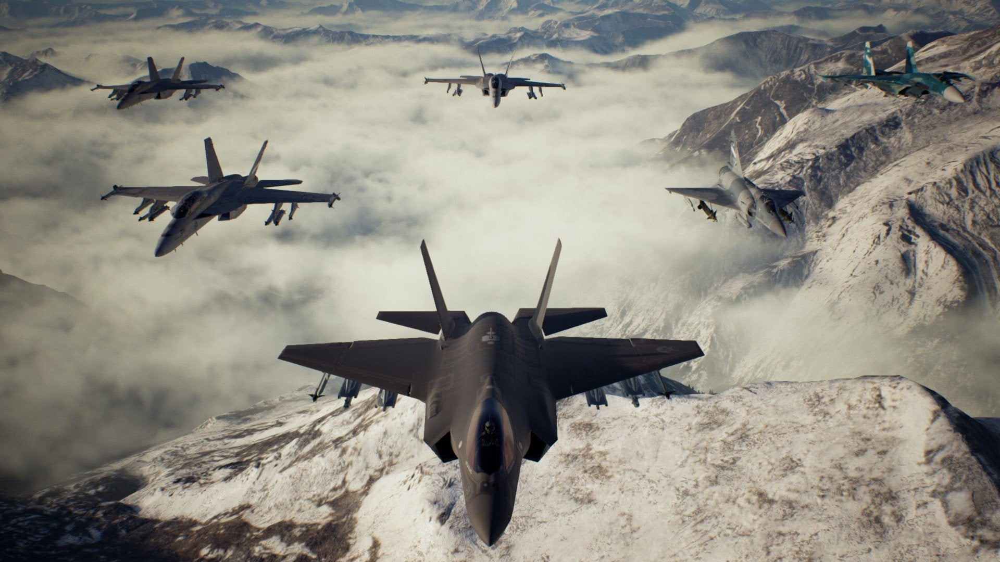

## Portfolio

---

### Professional Work 

[Ace Combat 7](https://youtu.be/HnU9v1IE1nw?t=15)

Worked on the Mechanic Team which was responsible for Aircraft & Vehicles

Responsible for migrating legacy asset data to new engine

Hardsurface Rigging and Animation for vehicle parts and weapon bays

Export and setup for aircraft destruction parts, VFX sockets

Cockpit instruments animation data export and animation setup

Responsible for VR Pilot Rigging and animation setup 
Maya Python Export pipeline tools to UE4 
In engine implementation & troubleshooting 

---
[Ghost Racing: Formula E](https://www.youtube.com/watch?v=ZhsEcBofBSo)

Creation of C# Editor Tools for Unity to improve workflows 
Runtime C# scripts for procedural asset setup/animation  
Creation of Export and Validation Python tools from Maya to Unity 
Documentation of implemented workflow, tools, and art assets optimization strategies 
Technical support for the artists 
Adhoc Art tasks when required 

---
[Star Wars 1313](https://youtu.be/vh820gAO7e8?t=130)

Droid Character & part of Damaged Ship Environment team 

---

### Personal Work

- [SDIPVFX 2018 - Crowd Animation: Houdini to Unity](https://docs.google.com/presentation/d/1nuwsu4v7RLQ45O0eFmXiSSW_0MKI0wT9Tfr_FqbIhn4/edit?usp=sharing)

Houdini Project done for Specialist Diploma in VFX at Nanyang Polytechnic 
Explored using Houdini to convert animated characters for use in Unity via Houdini Engine.

---

---

Page template forked from <a href="https://github.com/evanca/quick-portfolio">evanca</a>

<!-- Remove above link if you don't want to attibute -->
